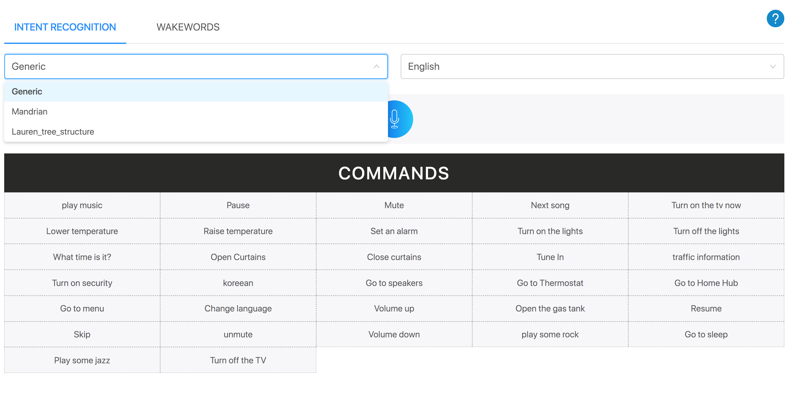

# React linked select filter

Displays a set of commands based on filtering from two linked select fields.
First one is to select a "Dataset" and another is to choose a "Language" of that dataset. When the "Dataset" changes, it will pick the very first language of that dataset and shows all the commands. you can also select different language and "Commands" will change.



## Installation

These instructions will get you a copy of the project up and running on your local machine.

### Prerequisites

You will need to have **_node_**, **_npm_** and **_Git_** installed and configured.

_clone the directory:_

```sh
git clone https://github.com/njausteve/react-nested-select-filter.git
```

_Install all dependencies:_

```sh
cd react-nested-select-filted

npm install
```

## Development setup

After all depencies are done installing, you can run the following commands from the terminal from the project's root directory.

```sh
npm start
```

Runs the app in development mode.
Open http://localhost:3000 to view it in the browser.

## Build setup

Builds the app for production to the build folder.
It correctly bundles React in production mode and optimizes the build for the best performance.

The build is minified and the filenames include the hashes.

```sh
npm run build
```

After seuccessful build, You may serve it with a static server.
Les use **serve** which does not come installed and needs to be installed globally.This can be done by running the following command

```sh
npm install -g serve
```

Now lets serve something and play around with it. Here run this final command.

```sh
 serve -s build
```

Serving!

* Local: http://localhost:5000

## Built With

* [React](https://reactjs.org/docs/hello-world.html) - The Javascript web library Used.
* [Antd](https://ant.design/) - Design system for Styling the UI.
* [npm/ yarn](https://www.npmjs.com/) - Dependency managenent.

## Meta

Stephen Njau – [@Dominosteve](https://twitter.com/Dominosteve)

Distributed under the ISC license. See `LICENSE` for more information.

## Contributing

1.  Fork it (<https://github.com/yourname/yourproject/fork>)
2.  Create your feature branch (`git checkout -b feature/fooBar`)
3.  Commit your changes (`git commit -am 'Add some fooBar'`)
4.  Push to the branch (`git push origin feature/fooBar`)
5.  Create a new Pull Request

<!-- Markdown link & img dfn's -->

[node-win]: http://blog.teamtreehouse.com/install-node-js-npm-windows
[node-osx]: http://blog.teamtreehouse.com/install-node-js-npm-mac
[node-linux]: http://blog.teamtreehouse.com/install-node-js-npm-linux
[git-install]: https://gist.github.com/derhuerst/1b15ff4652a867391f03
